# design.md – Listen & Type Feature

## Overview
The **Listen & Type** activity is the first core module of the language learning app.  
It combines **AI-powered sentence generation, audio playback, typed input capture, grading, and progress tracking** with long-term vocabulary frequency tracking.  

The design leverages:
- **Frontend** React/Next.js for user experience.  
- **Supabase** for authentication, database (Postgres), real-time sync.  
- **Backend functions** (Supabase Edge Functions) for grading and business logic.  
- **OpenAI API: text generation** for sentence generation
- **OpenAI API: audio generation** for audio generation of selected sentence

---

## High-Level Architecture

```
+-------------------+            +--------------------+           +--------------------+
|    Frontend App   | <--------> |   Supabase API     | <-------> |   Postgres DB      |
| (React / Next.js) |            | (Auth, Functions,  |           | (Users, Sessions,  |
|                   |            |  Realtime)         |           |  Sentences, Words) |
+-------------------+            +--------------------+           +--------------------+
         |                                |
         | (grading, sentence gen, TTS)   |
         v                                v
+-------------------+            +--------------------+
|   TTS API (on-    |            | Supabase Edge Fn   |
|   demand audio)   |            | (business logic)   |
+-------------------+            +--------------------+
         |
         v
+-------------------+
|   OpenAI API      |
| (sentence gen,    |
|  future feedback) |
+-------------------+
```

---

## Components

### 1. Frontend (React/Next.js)
- Allows user to select **difficulty level** (CEFR A1, A2, B1, B2, C1, and C2).
- Allows user to select sentence source
  - Option 1 - Default: Generate a new sentence at the selected difficulty level from OpenAI API via backend.
  - Option 2 - To be added in a future release: select from a list of built in texts such as scriptures and open sources books, stories, and movie scripts.\
  - Option 3 - To be added in a future release: user uploads a pdf or copy/pastes in a text. system chunks it into sentences.
- Once a sentence is loaded from one of the sources there is a play button that plays generated audio clips (via TTS API) with speed adjustment option. User may repeat the audio by pressing the button as many times as they like.
- Text input field for user to type what they here.
- Submit button allowing user to submit what they have typed
- Feedback panel, error highlights, and metrics.  
- Words in the sentence are added to the **Personal Dictionary** .  

### 2. Backend (Supabase)
- **Auth**: User sign-in, profiles.  
- **Postgres**: Tables for sentences, words, sessions, frequency maps.  
- **Realtime**: Live progress updates (e.g., word counters increment live).  
- **Edge Functions**: Grading logic, frequency updates, sentence management.  

### 3. Algorithms
- **Word Error Rate (WER)** – word-level correctness.  
- **Character Error Rate (CER)** – spelling precision.  
- **Accent Check** – diacritic accuracy.  
- Implemented in **Edge Functions** or frontend logic.  

### 4. TTS API
- Used to generate French audio clips on demand from stored sentence text.  
- Eliminates need to pre-store audio files.  

### 5. OpenAI API
- **MVP**: Generate French sentences at a given difficulty level and optional topic.  
- **Future**: Provide adaptive natural-language feedback and semantic checks.  

---

## Data Model (Postgres via Supabase)

### Tables

- **users**
  - `id` (PK)  
  - `email`  
  - `profile_info`  

- **sessions**
  - `id` (PK)  
  - `user_id` (FK → users.id)  
  - `start_time`  
  - `end_time`  
  - `words_listened_total`  
  - `words_typed_correct_total`  
  - `distinct_words_listened`  
  - `distinct_words_typed_correct`  

- **sentences**
  - `id` (PK)  
  - `text` (French sentence)  
  - `source` (enum: ai_generated, user_provided, built_in_library)  
  - `difficulty_level` (A1–C2)  
  - `topic` (optional text)  
  - `created_at`  

- **words**
  - `id` (PK)  
  - `text` (normalized form, lowercase, accents preserved)  

- **word_frequencies**
  - `id` (PK)  
  - `user_id` (FK → users.id)  
  - `word_id` (FK → words.id)  
  - `times_listened` (int)  
  - `times_typed_correct` (int)  

- **attempts**
  - `id` (PK)  
  - `session_id` (FK → sessions.id)  
  - `sentence_id` (FK → sentences.id)  
  - `user_input` (text)  
  - `score` (json: {wer, cer, accents, total})  
  - `replay_count` (int)  
  - `timestamp`  

### Relationships
- Each **session** belongs to a **user**.  
- Each **attempt** belongs to a **session** and references a **sentence**.  
- Each **word_frequency** entry belongs to a **user** and a **word**.  
- Words can be extracted from sentences → linked indirectly via attempts and grading logic.  

---

## Sequence Diagrams

### 1. Activity Flow (Listen & Type)

```mermaid
sequenceDiagram
    participant U as User
    participant F as Frontend
    participant S as Supabase
    participant E as Edge Function
    participant DB as Postgres
    participant OAI as OpenAI API
    participant T as TTS API

    U->>F: Start Listen & Type activity
    U->>F: Select difficulty level (A1–C2)
    F->>OAI: Request sentences (with difficulty level)
    OAI-->>F: Return generated sentences
    F->>DB: Store sentences with metadata
    F->>T: Request audio for sentence
    T-->>F: Return generated audio
    F->>U: Play audio

    U->>F: Type input and submit
    F->>E: Send user input + expected transcript
    E->>E: Compute WER + CER + Accent scoring
    E->>DB: Save attempt + scores + word frequencies
    E-->>F: Return feedback + highlights
    F->>U: Display feedback + updated metrics
```



---

## Implementation Considerations

### Sentence Generation
- Sentences generated via OpenAI API at start of session.  
- Difficulty level chosen by user (A1–C2).  
- Sentences cached in DB for reproducibility and tracking.  
- Each sentence linked to attempts for analytics.  

### Grading Logic
- Implement hybrid scoring in **Edge Functions**.  
- Store raw scores + normalized transcript for auditing.  

### Distinct & Frequency Tracking
- Use **Postgres UPSERTs** (`INSERT ... ON CONFLICT UPDATE`).  
- Maintain session-level aggregates in memory → write once at session end.  
- Use **views** to query top-N words for Personal Dictionary.  

### Performance
- Vocabulary up to **100k+ words** per user is feasible.  
- For Personal Dictionary: paginate queries (`LIMIT 50 OFFSET n`).  
- Pre-compute “weak words” (high listen count, low correct count).  

### Supabase Advantages
- Out-of-the-box auth, DB, and realtime.  
- Edge Functions handle backend logic.  
- Easy integration with TTS and OpenAI APIs.  

---

## Future Modules

The Listen & Type module is the first of four planned activities.  
The architecture supports modular growth so shared components  
(e.g., user profiles, word tracking, milestones) can be reused across modules.

Planned modules:
1. **Listen & Type 📖** (MVP) – implemented first.  
2. **Read & Speak 💬** – user reads a sentence aloud; system captures and grades speech.  
3. **Written Chat 🗣️** – dynamic chat interface for practicing conversation in writing.  
4. **Spoken Chat 🎤** – real-time voice-based conversation with adaptive feedback.

Each module reuses:
- **Supabase** for session logging, word tracking, and user data.  
- **Common scoring framework** for accuracy and progress metrics.  
- **Milestone tracking** (e.g., 1 million words listened to, 100k words spoken).  

## Tech Stack

- **Frontend**: React + Next.js  
  - UI components (Sentence playback, Input box, Feedback panel, Progress panel, Dictionary).  
  - Audio playback using Web Audio API or HTML5 `<audio>`.  

- **Backend (Serverless)**: Supabase  
  - **Auth**: User login, profiles.  
  - **Database**: Postgres for sessions, sentences, words, frequencies, attempts.  
  - **Edge Functions**: Business logic (grading, sentence generation, frequency updates).  
  - **Realtime**: Live updates for session and lifetime stats.  

- **AI APIs**:  
  - **OpenAI API** → Sentence generation (MVP) and optional adaptive feedback later.  
  - **TTS API (OpenAI or ElevenLabs)** → Generate French audio clips on demand.  

- **Deployment**:  
  - Frontend: Vercel or Netlify (Next.js hosting).  
  - Supabase: Managed cloud backend.  

- **Languages**:  
  - TypeScript (frontend + Supabase Edge Functions).  
  - SQL (Supabase migrations).  

- **Version Control & Collaboration**: GitHub + Supabase CLI migrations.

